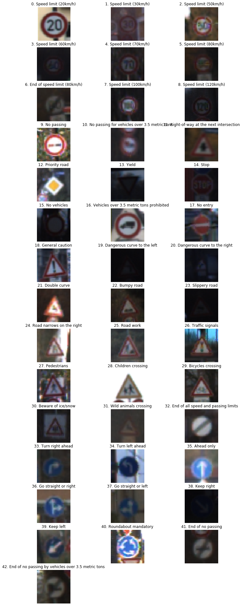
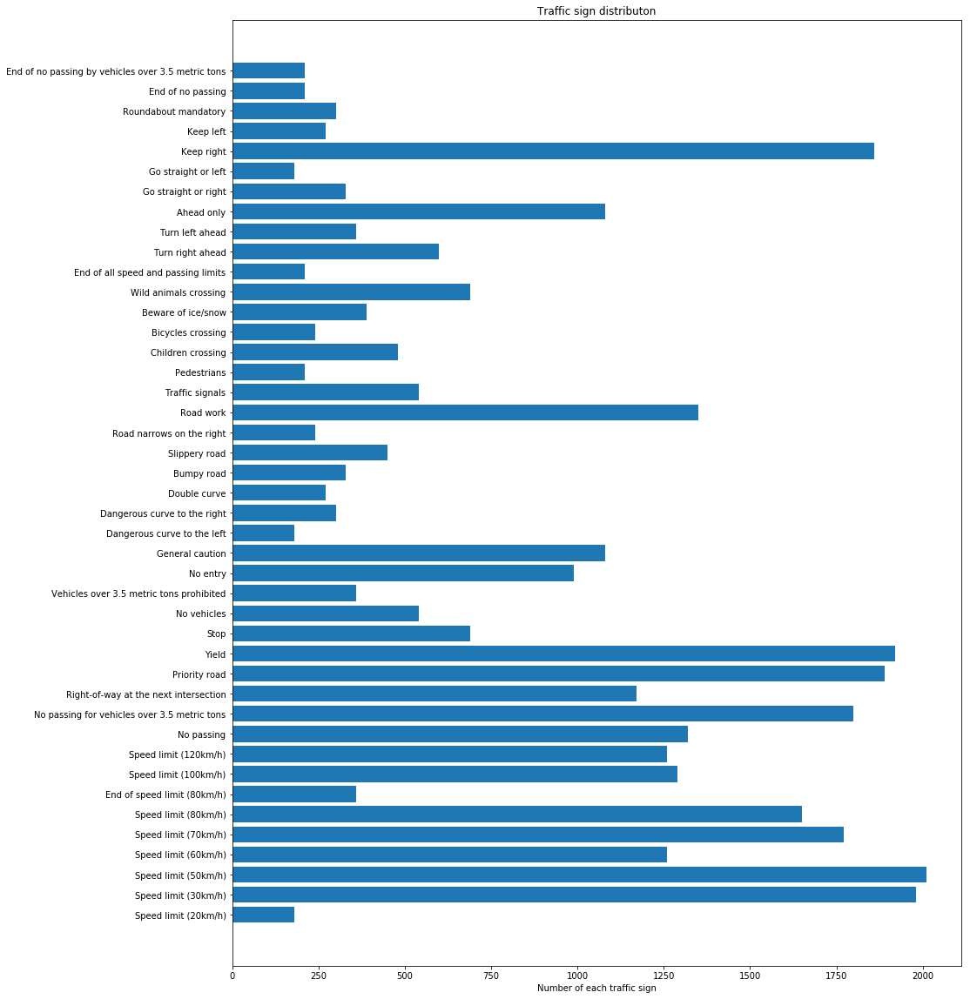
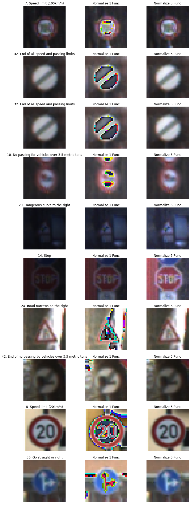
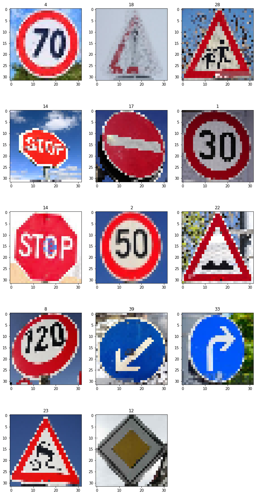
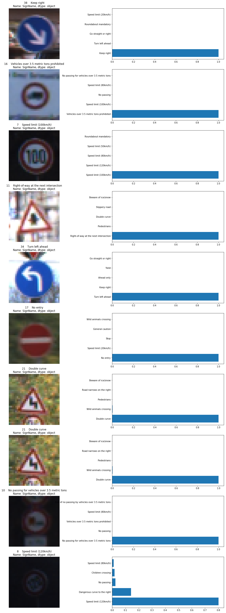
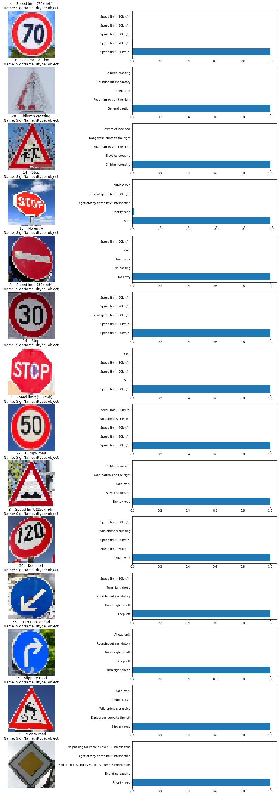

## Project: Build a Traffic Sign Recognition Program
[](http://www.udacity.com/drive)

Overview
---
The goals / steps of this project are the following:
* Load the data set
* Explore, summarize and visualize the data set
* Design, train and test a model architecture
* Use the model to make predictions on new images
* Analyze the softmax probabilities of the new images
* Summarize the results with a written report


### Here I will target the [rubric points](https://review.udacity.com/#!/rubrics/481/view) individually and describe how I addressed each point in my implementation.
---
### Files Submited
   Submission Files can also be found at : https://github.com/sanyam89/Project_3_Traffic_Sign_Classifier
   
   If the python file doesn't open, please try the following link: https://nbviewer.jupyter.org/github/sanyam89/Project_3_Traffic_Sign_Classifier/blob/master/Traffic_Sign_Classifier.ipynb
### Data Exploration
---
Dataset Summary: 
* Number of training example images = 34799
* Number of testing example images = 12630
* Image data shape = (32, 32, 3)
* Number of classes/ traffic signs = 43

Exploratory Visualization: Showing all 43 unique signs that will be used in this project to Identify different images of traffic signs


Below is the bar graph of the number of images available for the training image dataset per traffic sign.



## Design and Test a Model Architecture

### Preprocessing
I tried different preprocessing methods: 
* GaussianBlur
* Normalize1 - Normalize funciton suggested in the project
* Normalize2 - Normalize the image data by dividing all the pixel values by 255
* Normalize3 - Normalize the image data by dividing all the pixel values by the highest pixel value for that image
    
The normalize 3() function gave me the best results as it improved the contrast even on the dull images.
    
The comparison of the oritinal images, normalize1 (images) and normalize3 (images) is show below.


#### Model Architecture
	
The submission provides details of the characteristics and qualities of the architecture, including the type of model used, the number of layers, and the size of each layer. Visualizations emphasizing particular qualities of the architecture are encouraged.

#### Model Training
The submission describes how the model was trained by discussing what optimizer was used, batch size, number of epochs and values for hyperparameters.
I used the LeNet architecture with a change in the output shape for the final fully connected layer (cell 10). I later added two dropout layers to improve accuracy (explained later in this writeup). I stuck with a batch size of 128 which my machine was capable of handling. Most of my validation accuracy plots began stabilizing after 10 epochs and did not improve after 15 epochs (cell 9). This table summarizes my final model architecture.

Layer | Input shape | Output shape
----- | ----------- | ------------
Convolutional | 32x32x3 | 28x28x24
ReLU Activation | 28x28x24 | 28x28x24
Max Pooling | 28x28x24 | 14x14x24
Convolutional | 14x14x24 | 10x10x64
ReLU Activation | 10x10x64 | 10x10x64
Max Pooling | 10x10x64 | 5x5x64
Flatten | 5x5x64 | 1600x1
Fully Connected | 1600x1 | 280x1
ReLU Activation | 280x1 | 280x1
Fully Connected | 280x1 | 84x1
ReLU Activation | 84x1 | 84x1
Dropout | 84x1 | 84x1
Fully Connected | 84x1 | 43x1

#### Solution Approach
The training pipeline involved calculating the cross entropy loss for the training set logits over each epoch and using an Adam optimizer to minimize this loss. 
With the initial CNN that we used in the Lenet Lab, it was had to differentiate between speed limits of 30,50 and 70 Kmph. As they all have red circle anda white background with 0 as the second digit AND the horizontal line at the top of the first digit, the only difference was the lower portions of 3,5,7.

To address this, I tried to add the 1x1 convolution to extract more information from the Convolutional layer 1 but it didn't work as intended.

Then I added more depth to the Convolution Layer 1 (from 6 to 24) and Layer 2 (from 16 to 64). By doing so the speed limit images of 30,50,70 were able to be classified correctly for the most part.

I tried different combinations for:
* EPOCHs(10-30)
* Learning rate(0.001-0.0005)
* Batch size(100-500)

And the accuracy increased as I reduced the learning rate, started using the normalized images, increased the EPOCHs. Bigger batch size increased the speed of the code but the validation accuracy was not consisten.

Finally the configuration that gave me the best result was
* EPOCHs = 25 (higher epoch levels didn't significantly increase the accuracy)
* Learning rate = 0.0005
* Batch size = 100 (because of the smaller batch size, the accuracy improved)

Finally I was able to meet the target:
* Validation accuracy = 94.3%
* Test accuracy on test images = 93.1%
* Test accuracy on new images = 71.4%


### Test a Model on Test images dataset and New Images

#### Acquiring New Images
I used 14 images of German traffic signs and a couple which were taken from different angles from the web. All the images are visualized below.
There are 2 STOP signs from different angles, a 120kmph sign taken from below,  a 2-3 images which are in low light conditions and a 'general caution' sign that is half covered with snow. They should be difficult to identify as they are not very straightforward and sometimes might match with other signs given in the identifier dataset.



#### Performance on Test  Images - Model Certainty - Softmax Probabilities
To visualize my code performance I made a cell that chooses random images from the test data and evaluates those images and plots their top 5 softmax probabilities. As we can see in the image below, most of the images were identified correctly. The last image, 120 kmph with the sign tilted at 45 degree angle was identified correctly but probably because of the angle it showed some probability of other signs as well.

* Test accuracy on test images was 93.1%



#### Performance on New Images - Model Certainty - Softmax Probabilities
Then I performed the similar operation on the 14 new images that I obtained online. 

* My code identified 10 out of 14 correctly
* Test accuracy on new images was 71.4%

Some of the images that were not identified correctly could be because of the smaller image size, minute detials from the images were lost while resizing.
The model performance could be improved further if it can be specifically trained to identify the numbers and digits more effectively.




```python

```
